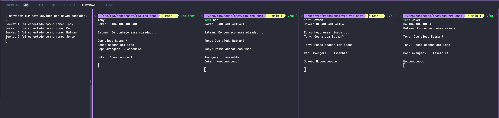

# FGA-FRC-Chat

## Identificação

Alunos: 
- Arthur Sena(18/0030345)
- Pedro Rodrigues(17/0062686)
- Youssef Muhamad(17/0024334)

## Como executar:

1. Compile os dois programas:

```
gcc -o server server.c && gcc -o client client.c
```

2. Execute o binário do `server`:

```
./server
```

3. Execute o binário do `client` passando o nome do usuário desejado:
```
./client João
```

4. Conecte quantos usuários deseja testar utilizando o comando `3`.

5. Todos os usuários estarão em uma única sala e suas mensagens serão enviadas a todos presentes nela.

